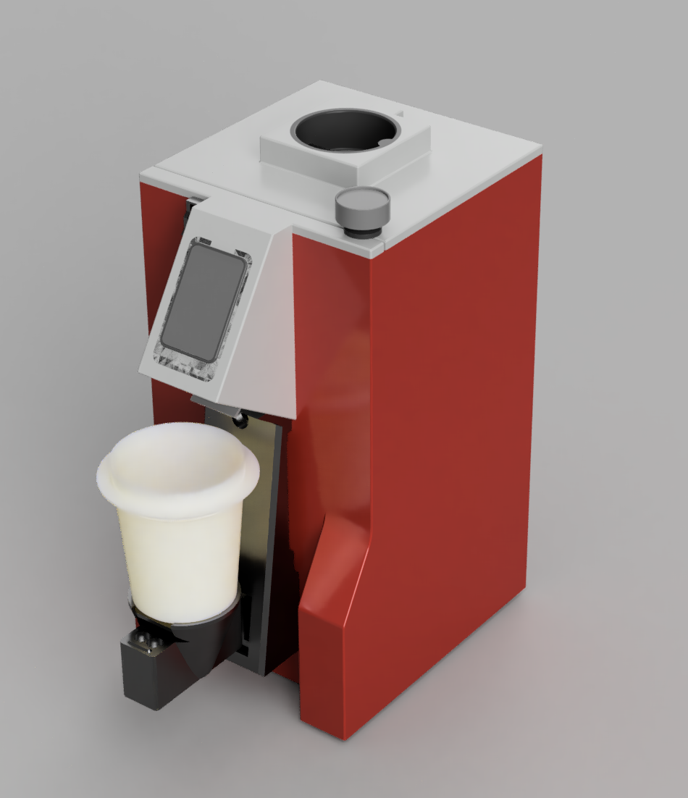
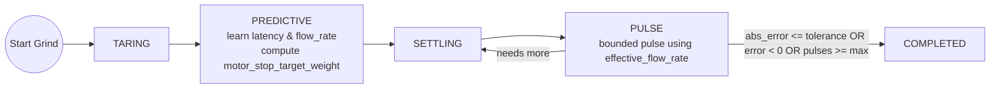
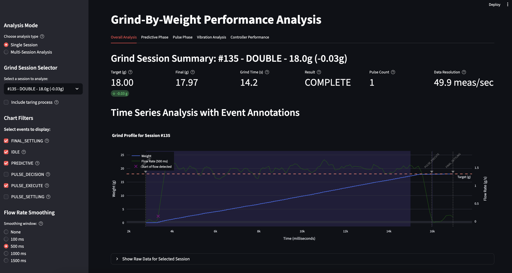

# Smart Grind-by-Weight

**Turn any grinder into a precision smart grind-by-weight system**

<table>
<tr>
<td width="50%">

https://github.com/user-attachments/assets/e20ce3e2-417e-4a3b-bb48-05591fce9418


</td>
<td width="50%">

[](media/smart-grind-by-weight-render.PNG)

</td>
</tr>
</table>

> **⚠️ Newly Released Mod - Buyer Beware!**  
> This is a **recently released modification project** that transforms grinders into smart grind-by-weight systems. While functional and free/open source, it's should be considered an **experimental mod** that requires technical skill to build and may have rough edges. **Build at your own risk** !


The Smart Grind-by-Weight is a user-friendly, touch interface-driven, highly accurate open source grinder modification that can transforms any grinder (with a accesable motor relay) into an intelligent grind-by-weight system. Originally developed for the Eureka Mignon Specialita, the system can be easily adapted for other grinders.

**The concept is simple:** Perform a "brain swap" on your grinder. Replace the original controller with our intelligent ESP32-S3 controller and add a precision load cell to the mix.

**Upgrade cost:** €30-40 in parts  
**Target accuracy:** ±0.03g tolerance  
**No regrets**: No permanent modifications, and original grind-by-time mode is also available

---

## 🔱 What's different in this fork

This is a fork of [jaapp/smart-grind-by-weight](https://github.com/jaapp/smart-grind-by-weight) with a round of stability, usability, and tooling improvements on top (firmware v2.3.0):

- **Native ESP-IDF 5.4 build** — PlatformIO removed; Espressif `esp_lcd_sh8601` display driver, IDF component manager, and CI/web-installer updated to match
- **Global navigation bar** — persistent back arrow, screen title, and Bluetooth/warning status icons on every screen, with a unified single-action-button screen layout
- **Scale tab** — live weight readout with explicit TARE and hold-to-grind GRIND buttons for manual top-offs; iOS-style page dots on the home tabview, with per-tab action buttons that slide with the swipe
- **Boot splash & faster boot** — logo splash auto-generated from a PNG at build time; the weight task starts early so HX711 bring-up overlaps BLE/UI init
- **Boot tare** — the scale zeroes itself on the first valid sample after startup, no persisted offset needed
- **Two-stage screensaver** — dim (or show the logo) after one timeout, turn the display fully off after a second, each configurable from 15s to 30min or Never
- **Major stability fix** — resolved a UI-task stack overflow (window-sized `alloca` in the load-cell ring-buffer math) that crashed the device after 1–3 minutes of uptime
- **Pulse autotune fixed** — time-based RMT pulse completion replaces a `digitalRead` on an output-only pin that hung PRIMING forever; the tune screen now shows a live weight/noise readout and real failure reasons
- **Dialog-style calibration** — guided step-by-step flow with one clear button per step
- **BLE reliability** — OTA GATT registration order fixed, Bluetooth re-enable works without a reboot, and an advertising watchdog recovers dropped connections
- **Hardware resilience & options** — runtime HX711 fault detection/recovery, active-low motor relay support, 180° screen rotation

**Full details** → See **[docs/FORK_IMPROVEMENTS.md](docs/FORK_IMPROVEMENTS.md)** for the complete write-up.

---

## ✨ Features

- **User-friendly interface** with 3 profiles: Single, Double, Custom
- **Beautiful display** with simple graphics or detailed charts (easily switchable)
- **High accuracy**: ±0.03g error tolerance  
- **Zero-shot learning**: Algorithm adapts instantly to any grind size, bean setting, humidity etc. without manual tuning
- **Original timed run preserved** – there is a setting to enable the original Grind-By-Time mode
- **BLE OTA updates** for firmware
- **Advanced analytics** using BLE data transfer and Python Streamlit reports
- **For Eureka**: No permanent modifications needed - just swap the screen and add 3D printed parts

---

## 🧠 Intelligent Grinding Algorithm

Our predictive grinding system uses a zero-shot learning approach that adapts to any conditions:



**Key Innovation:** The algorithm learns grind latency and flow rate in real-time, then uses predictive control to stop just before the target weight, followed by precision pulses to reach exact accuracy. No manual tuning required.

---

## 🚀 Quick Start

### For Users - Using Pre-built Firmware

1. **Get the parts** - ESP32-S3 AMOLED display + HX711 + load cell (~€35 total) → See [Parts List](docs/DOC.md#-parts-list)
2. **3D print the mounting parts** - All STL files included, no supports needed → See [3D Printed Parts](docs/DOC.md#3d-printed-parts) | [Community Designs](docs/3D_PRINTS.md)
3. **Flash firmware & calibrate** - [Web Flasher](https://jaapp.github.io/smart-grind-by-weight) (Chrome/Edge desktop + Android only) or command line
4. **Follow the assembly video** - [Complete Eureka build process](https://youtu.be/-kfKjiwJsGM)

**Ready to build?** → See **[DOC.md](docs/DOC.md)** for complete build instructions, parts list, and usage guide.

---

### For Developers - Building from Source

The firmware builds with **native ESP-IDF** (`python3 tools/grinder.py build`, or `idf.py` directly) — there is no PlatformIO. If you want to modify the code or contribute to development, see **[DEVELOPMENT.md](docs/DEVELOPMENT.md)** for build instructions.

**Design Files:** The complete Fusion 360 design is available at `3d_files/smart-grind-by-weight. Eureka Mignon.f3z` for modification and adaptation to other grinder models.

---

## 📊 Analytics Dashboard

[](media/analytics.png)

Export your grind data and analyze it with the included Streamlit dashboard:

```bash
python3 tools/grinder.py analyze
```

Track accuracy, flow rates, grind times, and optimize your coffee workflow with detailed session analytics.

---

## 🙏 Credits & Inspiration

This project was inspired by and builds upon the excellent work of:

- **[openGBW](https://github.com/jb-xyz/openGBW)** by jb-xyz - Open source grind-by-weight system
- **[Coffee Grinder Smart Scale](https://besson.co/projects/coffee-grinder-smart-scale)** by Besson - Smart scale integration concepts

---

## 📝 Personal Note

My goal with this project was to get real-life experience coding with AI agents. The code reflects that learning journey. I've learned a lot, and ultimately I'm in awe of how fast you can produce results with AI assistance. 

What I've learned so far is that "vibe coding" with AI is great for POCs and testing theories. But afterward you must pivot and reimplement features while keeping a close eye on the architecture the AI produces. Otherwise you'll get stuck at dead ends that require painful refactoring (been there, done that). 

In this project, that's most obvious when at state management - it's a bit cluttered in places. I'm very happy with the end result and I'm releasing the project as is. It eliminates grind weight variability from the espresso equation, bringing you one step closer to dialing in perfect shots.

**Project Status**: This project is shared 'as-is' and I have limited availability for support. While I'm happy to share what I've built, please understand that troubleshooting and feature requests may receive limited attention.

**Want to dive deeper?** → Check out **[DOC.md](docs/DOC.md)** for comprehensive documentation.

**Different grinder?** → See **[Grinder Compatibility Matrix](docs/GRINDER_COMPATIBILITY.md)** for adaptation guidance.

**Having issues?** → See **[TROUBLESHOOTING.md](docs/TROUBLESHOOTING.md)** for common problems and solutions.

**Changelog & Updates** → See **[Releases](https://github.com/jaapp/smart-grind-by-weight/releases)** for version history and updates.
